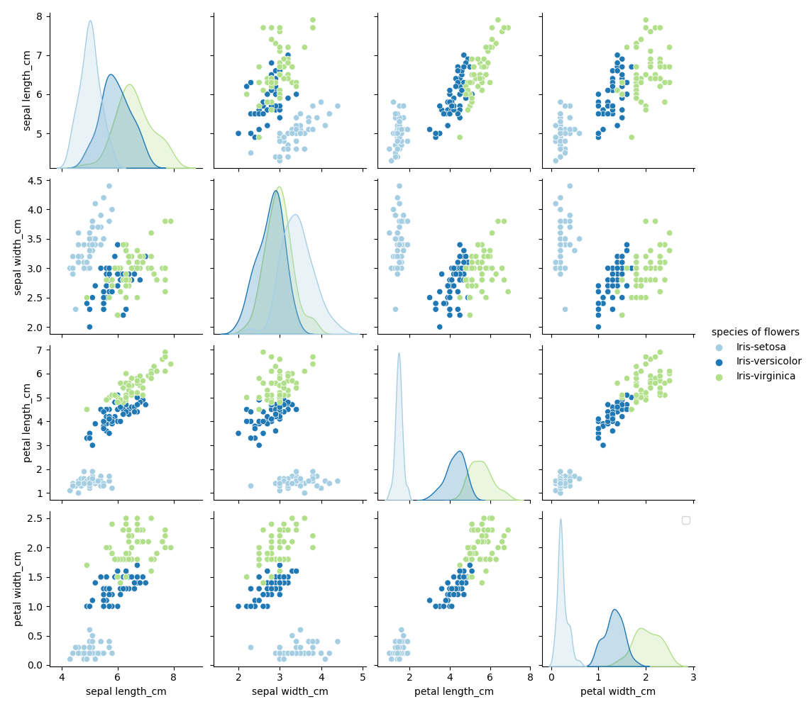
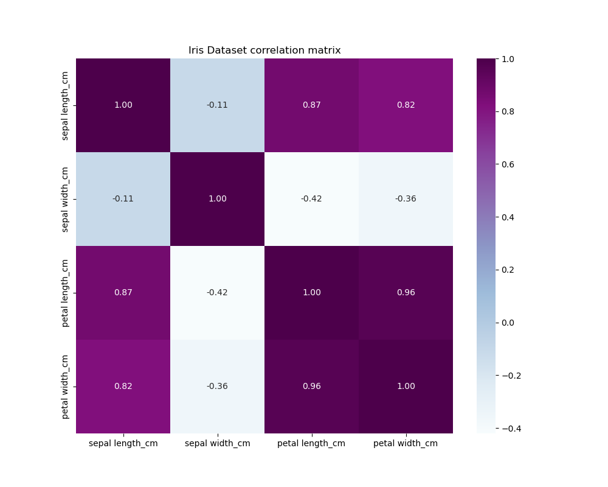
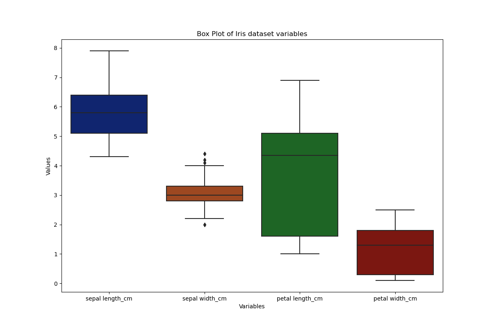
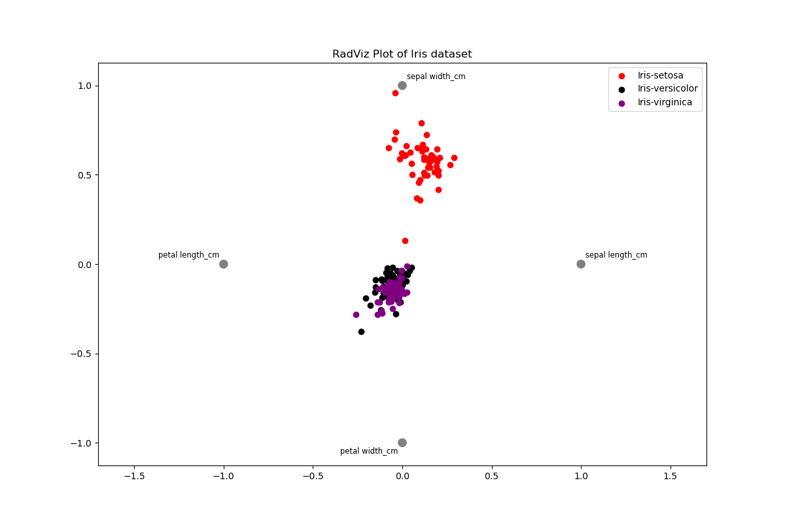

# The Project on the module "Programming and scripting" 

#### **Analysis of the Iris flower dataset using Python**


This repository contains an analysis of the Iris flower dataset used by the famous British statistician and biologist [Ronald Fisher](https://en.wikipedia.org/wiki/Ronald_Fisher) to demonstrate the method of linear discriminant analysis in 1936. The data set was collected by botanist [Edgar Anderson](https://en.wikipedia.org/wiki/Edgar_Anderson). 

#### **Key Objectives**:

1. **Data Summary**: The program outputs a comprehensive summary of each variable in the dataset to a single text file. This summary includes general characteristics of variables, checking for missing values, and counting the number of flowers of each species, statistics for each dataset variable is additionally generated in separate text files.
2. **Histogram Generation**: Histograms of each variable are saved as PNG files. Histograms provide insights into the distribution of values for each feature and help identify patterns and outliers.
3. **Scatter Plot Creation**: The program generates scatter plots of each pair of variables. Scatter plots visualize the relationship between two variables and can reveal correlations or patterns in the data.
4. **Additional Analysis**: The program conducts any other pertinent analysis necessary for gaining deeper insights into the dataset. This includes calculating individual and mean ratios of length-to-width variables, generating a correlation matrix, and saving it to a separate file.


[WikipediA's](https://en.wikipedia.org/wiki/Iris_flower_data_set) description of the dataset.


Downloaded from this resource-[Fisher's Iris data](https://archive.ics.uci.edu/dataset/53/iris).

***

#### Components of the dataset:

- sepal length in cm
- sepal width in cm
- petal length in cm
- petal width in cm
- species of Flowers(setosa,versicolor, virginica)

#### Overview of the Iris dataset: 

1. There are 150 rows.
3. Each row has a row index with values ranging from 0 to 149.
4. The table has 5 columns. all the columns have a value for each of the rows (all 150 values are non-null). 
5. The columns sepal length in cm, sepal width in cm,  petal length in cm, petal width in cm contain float type data (float64). The column species of flowers contains string type data (object).


#### Data analysis Python libraries required: 

 - Pandas - to read, manipulate, calculate data, review data types 
 - Numpy - to calculate data
 - Matplotlib.pyplot - to create plots 
 - Seaborn - to visualise rezults of analysis 
 - CSV - to read, write, and process data from CSV files

***

#### Get started

1. Clone the repository to your local machine:

> git clone <repository_url>

2. Navigate to the project directory:

> cd <project_directory>

3. Install the required dependencies. You can install them using pip:

> pip install pandas numpy matplotlib.pyplot seaborn

4. Once the dependencies are installed, you can run the program by executing the analysis.py script:

> python analysis.py

The program will generate summary information about the dataset, histograms for each variable, scatter plots for pairs of variables, and additional analysis such as individual and mean ratios, and a correlation matrix.
Explore the generated files and outputs to gain insights into the dataset. You can further customize the analysis according to your requirements by modifying the analysis.py script.

***

#### Description of the files in the repository

* <span style="color:purple">__.gitignore__</span> 

> File format: Text. Description: Specifies files and directories to be ignored by Git during commits and updates.

* <span style="color:purple">__analysis.py__</span>

> File format: Python script (.py). Description: Python script for analyzing the Iris dataset. Generates various analytical results based on the data.

* <span style="color:purple">__Corelation_matrix.png__</span>

> File format: PNG image. Description: Correlation matrix demonstrating the relationship between variables in the Iris dataset. Generated using the analysis script.

* <span style="color:purple">__Individual_ratios.txt__</span>

> File format: Text. Description: File containing individual length-to-width ratios for each iris specimen. Generated using the analysis script.

* <span style="color:purple">__iris-pic.png__</span>

> File format: PNG image. Description: Image of an iris, used for visualization in README.

* <span style="color:purple">__iris.csv__</span>

> File format: CSV. Description: Iris dataset containing information about the length and width of sepals and petals of iris flowers.

* <span style="color:purple">__Mean_ratios.txt__</span>

> File format: Text. Description: File containing mean length-to-width ratios for each iris species. Generated using the analysis script.

* <span style="color:purple">__petal length_cm_histogram.png, petal width_cm_histogram.png, sepal length_cm_histogram.png, sepal width_cm_histogram.png, species of flowers_histogram.png__</span>

> File format: PNG image. Description: Histograms for each variable in the Iris dataset. Generated using the analysis script.

* <span style="color:purple">__petal length_cm(Summary).txt, petal width_cm(Summary).txt, sepal length_cm(Summary).txt, sepal width_cm(Summary).txt, species of flowers(Summary).txt__</span>

> File format: Text. Description: Files with a brief description of each variable in the Iris dataset. Generated using the analysis script.

* <span style="color:purple">__ratio.py__</span>

>  File format: Python script (.py). Description: Python module containing functions for calculating individual and mean length-to-width ratios.

* <span style="color:purple">__README.md__</span>

> File format: Markdown (.md). Description: README file with project description, installation and usage instructions, description of files and analytical conclusions based on the results obtained. 

* <span style="color:purple">__scatter_plot.png__</span>

> File format: PNG image. Description: Scatter plot showing relationships between pairs of variables in the Iris dataset. Generated using the analysis script.

* <span style="color:purple">__Summary.txt__</span>

> File format: Text. Description: File containing summary information about the Iris dataset. Generated using the analysis script.


***

#### Description of the Iris flower data analysis process

First of all, let's start by specifying the essential libraries and modules utilized to gather information about the Iris flower dataset in the main analysis.py script.

```python
import pandas as pd 
import numpy as np 
import matplotlib.pyplot as plt 
import seaborn as sns 
import ratio
```

The iris.csv file was assigned as a variable. 

```python
filename="iris.csv"
```

1. **Data Summary**. 

A function that reads data from a file and returns it is used in all subsequent functions. 

```python
def read_with_pandas():
   try:
      data=pd.read_csv(filename)
      return data 
   except FileNotFoundError:
      print(f"File{filename} is not found")
```

Three functions were created to obtain general characteristics for the variables: 

```python
def summary_info():  
```
This function calculates and returns summary statistics for variables in the Iris dataset.
It gives summary characteristics such as count, mean, standard deviation, minimum, 25th percentile, median, 75th percentile, and maximum for each variable.
Summary statistics can be displayed on the console by adding print (summaryinfo) at the end of the function.

```python
def summary_info_results():
```

This function calls summary_info() to get summary statistics for the Iris dataset.
It then writes the summary statistics to a text file named "Summary.txt" for ease of use and sharing.
The summary information includes general characteristics of the variables, checking for missing values, counts of the number of flowers of each species, and characteristics of variables by each species.

```python
def separate_summary_info():
```

This function extracts and prints separate summary statistics for each variable in the Iris dataset.
It creates separate text files for each variable containing its descriptive statistics.
The summary statistics for each variable include the count, mean, standard deviation, minimum, 25th percentile, median, 75th percentile, and maximum value.

General characteristics of variables are: 


|              | sepal length_cm | sepal width_cm | petal length_cm | petal width_cm |
|--------------|-----------------|----------------|-----------------|----------------|
| count        | 150.000000      | 150.000000     | 150.000000      | 150.000000     |
| mean         | 5.843333        | 3.054000       | 3.758667        | 1.198667       |
| std          | 0.828066        | 0.433594       | 1.764420        | 0.763161       |
| min          | 4.300000        | 2.000000       | 1.000000        | 0.100000       |
| 25%          | 5.100000        | 2.800000       | 1.600000        | 0.300000       |
| 50%          | 5.800000        | 3.000000       | 4.350000        | 1.300000       |
| 75%          | 6.400000        | 3.300000       | 5.100000        | 1.800000       |
| max          | 7.900000        | 4.400000       | 6.900000        | 2.500000       |


**Quick observation**: There are 150 measurements for each variable, 
the mean values of sepal length, sepal width, petal length and petal width are approximately 5.84 cm, 3.05 cm, 3.76 cm and 1.20 cm respectively, the standard deviation measures the variance or spread of values around the mean. The minimum is the smallest observed value for each variable. For example, the minimum sepal length is 4.3 cm, the minimum sepal width is 2.0 cm, and so on.
25th percentile (Q1): the first quartile boundary below which 25% of the observations are below. 50th percentile (median) (Q2): divides the data set into two equal halves. 75th percentile (Q3): the third quartile is the boundary below which 75% of the observations are below. 
Maximum is the largest observed values for each variable. For example, the maximum sepal length is 7.9 cm, the maximum sepal width is 4.4 cm, and so on.

2. **Histogram Generation**. 

Histograms are used to visualise the frequency of data distribution to be investigated. The WikipediA's description of histogram definition is [here](https://en.wikipedia.org/wiki/Histogram).

To generate histograms for each variable this function was created: 

```python
def safe_histogram():
```
The outputs are: 

<div style="display:flex; flex-direction:row;">
    
    
</div>

<div style="display:flex; flex-direction:row;">
    
    
</div>

These histograms provide visual insights into the distribution of each variable and can be useful for exploratory data analysis.

**Quick observation**. The x-axis represents the values of the variables, while the y-axis represents their frequency or distribution density. Each plot is divided into 10 cells (bins) containing the values of a variable with a certain frequency of occurrence. Upon closer examination of these images, it becomes apparent that the variables "petal length" and "petal width" exhibit skewed distributions. The highest frequency of "petal length" values is observed between 1-1.5 cm, while there is an absence of frequencies between 2-2.9 cm. The variable ranges from 1 to 6.9 cm.

For the variable "petal width", the highest frequency of values is recorded between 0.1-0.3 cm. There is a very low frequency (only 1-2 specimens) between 0.5-0.6 cm. The range extends from 0.1 to 2.5 cm.

As for "sepal length" and "sepal width", their distribution histograms exhibit a more uniform pattern, particularly the frequency of "sepal width", demonstrating a normal distribution of the variable in the plot. Let's look at the most frequent values:

"sepal length": between 5.4 and 5.7 cm, with a range from 4.3 to 7.9 cm.
"sepal width": between 2.9 and 3.2 cm, with a range from 2 to 4.4 cm.

Also the output of species of flowers was generated: 

<div style="display:flex; flex-direction:row;">
    
</div>

This clearly shows that there are three variables that occur with the same frequency and it is equal to 50.

3. **Scatter Plot Creation**. 

The WikipediA's description of Scatter Plot definition is [here](https://en.wikipedia.org/wiki/Scatter_plot).

For scatter plot generation this function exists: 

```python
def save_scatter_plot():
```   

The output is: 

<div style="display:flex; flex-direction:row;">
    
</div>

it generates 16 plots on a single figure. This happens because each variable is plotted on the axes as both X and Y in every combination with the other variables, including itself. Thus, it creates a matrix of 4x4 plots, where each plot represents a combination of two variables.

**Quick observation**. Looking at the matrix, certain patterns in the relationships between variables can be observed. For instance, it's evident that the variables "petal length" and "petal width" exhibit a strong correlation and demonstrate a linear relationship with each other. The points of their intersection visually depict a resemblance to a straight line, supporting the previous conclusion. Additionally, it's apparent that the Iris-setosa species is visually distinct from the other two species, indicating that this species is easily distinguishable based on its morphological features among all the studied species in the dataset. Nevertheless, the variables show varying degrees of relationships, as inferred from their respective graphical visualizations.

4. **Additional Analysis**. 

In the "Additional Analysis" section, three functions and a module are proposed:  

First: 

```python
def correlation_matrix():
```
This function is designed to construct a correlation matrix for the variables in the Iris dataset. It generates a heatmap of correlation, displaying the degree of linear relationship between variables. The variable "species of flowers" is excluded from consideration as it is a categorical variable. The output is a heatmap with annotations, illustrating the correlation coefficients between variables.

The output is: 

<div style="display:flex; flex-direction:row;">
    
</div>

**Quick observation**. Correlation analysis helps to understand how variables are related. It uses a number called the [correlation coefficient](https://en.wikipedia.org/wiki/Correlation_coefficient), which can range from -1 to +1. This number tells us how strong the relationship is between the variables and whether it's positive or negative. 
The Wikipedia's description of what correlation is [here](https://en.wikipedia.org/wiki/Correlation).

The most popular ways to find correlation between variables are:

* [Pearson correlation](https://en.wikipedia.org/wiki/Pearson_correlation_coefficient): Checks how much two continuous variables change together in a straight line.
* [Spearman correlation](https://en.wikipedia.org/wiki/Spearman%27s_rank_correlation_coefficient): Checks if two variables change together, but it doesn't need a straight line.
* [Kendall correlation](https://en.wikipedia.org/wiki/Kendall_rank_correlation_coefficient): Similar to Spearman's, but it also considers if the variables change together in pairs.

The NumPy library was used in the above python function: [numpy.corrcoef()](https://numpy.org/doc/stable/reference/generated/numpy.corrcoef.html). This function computes the Pearson correlation coefficient between two or more arrays. It takes the arrays as input and returns a correlation matrix.

Analyzing the data from the matrix:

| Variable 1    | Variable 2    | Correlation Coefficient | Relationship Description              |
|---------------|---------------|------------------------|----------------------------------------|
| Petal Length  | Petal Width   | 0.96                   | Strong positive correlation            |
| Petal Length  | Sepal Length  | 0.87                   | Strong positive correlation            |
| Sepal Length  | Petal Width   | 0.82                   | Strong positive correlation            |
| Sepal Length  | Sepal Width   | -0.11                  | No correlation                         |
| Sepal Width   | Petal Width   | -0.36                  | Weak negative correlation              |
| Sepal Width   | Petal Length  | -0.42                  | Weak negative correlation              |


Second:

```python
def save_boxplots():
```

The function was created to generate and save box plots for the Iris dataset. This visualization helps in understanding the range, median, and variability of each measurement within the dataset. By doing so, it provides insights into the statistical properties of the dataset and highlights any potential outliers or differences in the distributions of these variables.

The output is: 

<div style="display:flex; flex-direction:row;">
    
</div>

Third: 

```python
def save_radviz_plot():
```

The function was created to generate and save a RadViz plot for the Iris dataset, which helps visualize the relationships and similarities between different species based on their features.

The output is: 

<div style="display:flex; flex-direction:row;">
    
</div>

**Quick observation**. A RadViz (Radial Visualization) plot is a tool for visualizing multivariate data in a two-dimensional space. Each variable is assigned to a point on the circumference of a circle (called an anchor), and each data point is plotted within the circle based on the influence of each variable.
The RadViz plot helps identify clusters of data points with similar characteristics. Looking at the resulting plot, it is clear that Iris-virginica and Iris-versicolor have very similar characteristics and are difficult to distinguish from each other, while Iris Setosa is separated from the other two species. Additionally, data points located closer to a specific anchor indicate that the corresponding variable has a stronger influence on these points. For instance, the variable "Sepal width" has the most influence on the species Iris-setosa.

```python
def main():
   summary_info_results()
   separate_summary_info()
   safe_histogram()
   save_scatter_plot()
   correlation_matrix() 
   save_boxplots()
   save_radviz_plot()
   ratio.individual_and_mean_ratios()
   print("The project is completed")
```
The individual_and_mean_ratios() function serves to compute individual and mean ratios for the length and width of petals and sepals for each species of iris. It analyzes the data from the Iris dataset, calculates ratios for each iris specimen, and computes the average ratios for each iris species. The function returns the results in text format and also writes them to files named "Individual_ratios.txt" and "Mean_ratios.txt".
The individual_and_mean_ratios() function is organized in a separate module and is invoked by the main program to perform specific analysis tasks.
The main() function serves as the entry point for executing the analysis tasks on the Iris dataset. By organizing these tasks within main(), the code becomes more modular and easier to manage.

The module **`ratio.py`** contains two functions, the first of which 
```python
def read_fileCSV(): 
```   
was created as an alternative and allows the use of the CSV module to read data. It can be used to translate data to the console by columns and perform various manipulations with them if needed.

 The second one is: 
```python
def individual_and_mean_ratios(): 
``` 
which is called by the analysis.py script. It performs calculations and visualises the results to separate files named "Individual_ratios.txt" and "Mean_ratios.txt".

The output of mean ratios is: 
``` 
Mean Ratios:
Species: Iris-setosa
Mean Petal Length to Width Ratio: 7.08
Mean Sepal Length to Width Ratio: 1.47

Species: Iris-versicolor
Mean Petal Length to Width Ratio: 3.24
Mean Sepal Length to Width Ratio: 2.16

Species: Iris-virginica
Mean Petal Length to Width Ratio: 2.78
Mean Sepal Length to Width Ratio: 2.23
``` 

**Quick observation**.  Individual ratios serve the purpose of providing a quantitative measure of the proportional relationships between specific variables, which can be further utilized for data visualization and analysis.
The mean ratios offer insights into the size proportions of petals and sepals for each iris species. For Iris-setosa, the petals are notably longer compared to their width, with a mean petal length to width ratio of 7.08. In Iris-versicolor, there's a more balanced proportion between sepal length and width, indicated by a mean sepal length to width ratio of 2.16. Iris-virginica falls between the other two species, with mean ratios indicating intermediate proportions.
These ratios provide a simple way to understand the physical characteristics of each iris species, helping in their identification and classification.


#### Author

This project was created by **Yuliia Kharchenko**. 


*** 

#### References: 
* [Pandas. User guide.](https://pandas.pydata.org/docs/user_guide/index.html)
* [NumPy fundamentals](https://numpy.org/doc/stable/user/basics.html)
* [Matplotlib.pyplot](https://matplotlib.org/3.5.3/api/_as_gen/matplotlib.pyplot.html)
* [Seaborn: statistical data visualization](https://seaborn.pydata.org/#seaborn-statistical-data-visualization)
* [CSV File Reading and Writing](https://docs.python.org/3/library/csv.html)
* [pandas.plotting.radviz](https://pandas.pydata.org/docs/reference/api/pandas.plotting.radviz.html)
* [What is the RadViz plot in pandas?](https://www.educative.io/answers/what-is-the-radviz-plot-in-pandas)
* [Markdown Cheat Sheet](https://www.markdownguide.org/cheat-sheet/)
* [How to apply color on text in Markdown](https://stackoverflow.com/questions/35465557/how-to-apply-color-on-text-in-markdown)
* [Reading and Writing CSV Files in Python_Real_Python](https://realpython.com/python-csv/)
* [Exploratory Data Analysis on Iris Dataset on www.geeksforgeeks.org](https://www.geeksforgeeks.org/exploratory-data-analysis-on-iris-dataset/)
* [Exploratory Data Analysis on Iris Dataset](https://www.tutorialspoint.com/exploratory-data-analysis-on-iris-dataset)
* [Iris Flower Data Set on www.devx.com](https://www.devx.com/terms/iris-flower-data-set/)
* [WikipediA's Ratio](https://en.wikipedia.org/wiki/Ratio)


***

### END